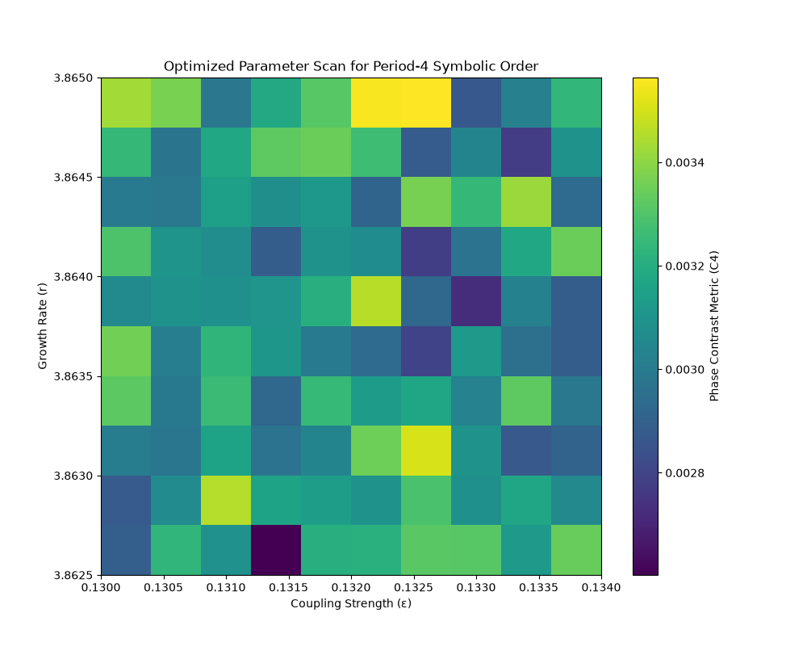

# Optimized Parameter Scan for Period-4 Symbolic Order

## Parameters
- r: [3.8625     3.86277778 3.86305556 3.86333333 3.86361111 3.86388889
 3.86416667 3.86444444 3.86472222 3.865     ]
- ε: [0.13       0.13044444 0.13088889 0.13133333 0.13177778 0.13222222
 0.13266667 0.13311111 0.13355556 0.134     ]
- N: 100
- T: 500

## Results

### Max C4: 0.004
### Min C4: 0.003
### Mean C4: 0.003

## Conclusion
No period-4 symbolic order detected in the parameter space.
